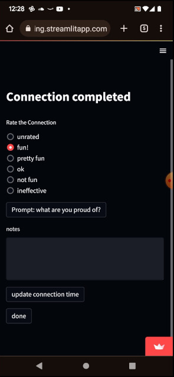

## Companion app for the [you are interesting](https://you-are-interesting.netlify.app/) project.

The [you are interesting](https://you-are-interesting.netlify.app/) project is an experiment in fun and connection. The idea is to create a context for brief, fun conversations with strangers.

This app isn't required to execute on this idea, but if you wanted track metrics of the connections being made, this is the app to do it.

#### It tracks:
* Who is staffing the project at any given time
* What prompts are being offered at the moment
* How many people the staff are connecting with

#### Tracking per conversation:
* The prompt chosen for the conversation
* The length and quality of that connection
* Notes you might want to take about the conversation for later reference

A 3 minute [video tutorial](https://youtu.be/Pf7Mph9q2bw)

The app is built in [Vue](https://vuejs.org/) and AWS [Amplify](https://aws.amazon.com/amplify/)
